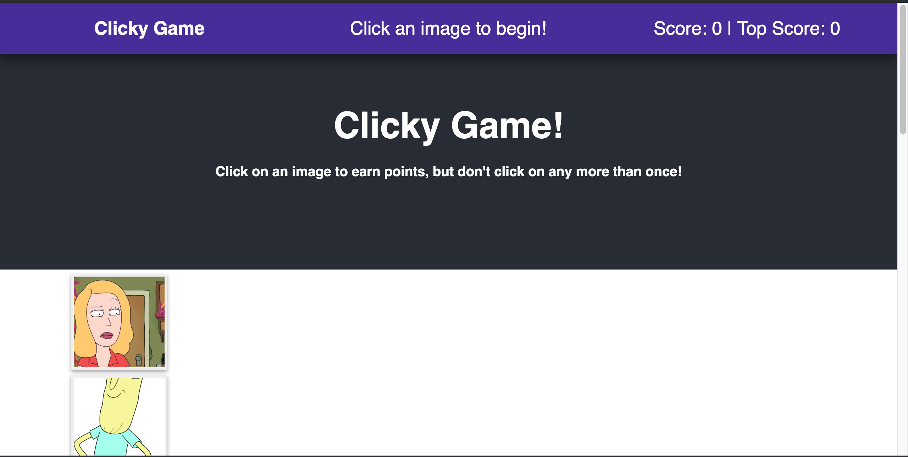

**React Memory Game**

**ScreenShot**

Format: 

**About**

This is a simple memory game created with React. Every time an image is clicked, the images rendered to the page should shuffle themselves in a random order. Once the user's score is reset after an incorrect guess, the game should restart.

**Technology Used**
Node.js
React

**How it Works**
How it works
The application renders different images from the show Rick and Morty.

Pictures are shuffled each time a user clicks an image. The task for the user is to click on each image once and only once.

The application keeps track of the user's score. Correct Guesses score is incremented each time the user clicks on an image for the first time in the current round.

Correct guesses score is reset to 0, if the user clicks on an image they're already clicked on in the current round.

The application keeps track of the users Best Score, and updates it when the user achieves a new Best Score.
